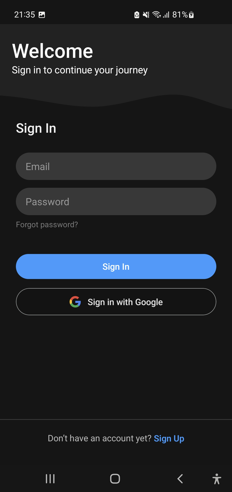

# FeelingBurnout
FeelingBurnout is a personal project created to explore and learn React Native and Expo development by building a mental wellness app. It focuses on implementing practical features like mood tracking, journaling, goal setting, and guided relaxation techniques, while integrating modern tools such as Supabase for authentication and realtime database management, Google Sign-In for easy user access, and state management with Zustand and Legend State for seamless local-first data synchronization.

## Features
- **Mood Logging:** Capture and track your mood with ease to identify trends and patterns.
- **Journal Entries:** Write and store personal reflections in journal.
- **Goal Tracking:** Set and manage your personal goals and bounderies.
- **Relax Zone:** Breathing exercises and guided meditation.

## Overview
### User Management
- Authentication handled via **Supabase Auth** with secure user sessions.
- Supports **Google Sign-In** for seamless, social login.

### State Management
- Uses **Zustand** for lightweight and scalable state management.
- Implements **Legend State** for local-first database synchronization with Supabase

### Database & Data Sync
- Built on **Supabase** for backend-as-a-service with PostgreSQL and realtime updates.
- **Legend State** acts as a local cache and sync manager, enabling instant data access and conflict resolution.
- User data including moods, journal entries, and goals are synced efficiently between client and server.

### Animations & UI
- **React Native Reanimated** components used to deliver fluid, high-performance animations and improve user experience throughout the app.

## Screenshots

  
  
  

  
  
  

